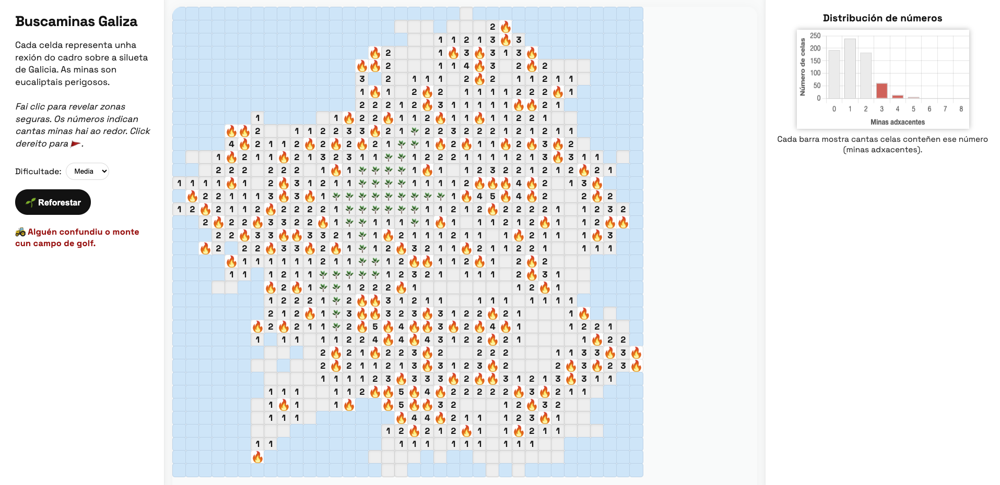

# 🌿 Buscaminas Galiza

Versión do clásico **Buscaminas** ambientada na silueta de Galiza.  
As minas son eucaliptais, unha especie que hoxe ocupa arredor de **409.000 hectáreas**, case o **28% da superficie forestal galega**. A súa expansión multiplicouse por dez nos últimos 50 anos, até o punto de que **un de cada tres árbores en Galiza é xa un eucalipto**.



---

## 🎯 Características

- **Mapa galego**: o taboleiro adopta a silueta da nosa terra.
- **Iconas personalizadas**: 🌿 eucaliptos para minas, 🔥 lume ao perder.
- **Estatísticas en tempo real**: histograma cos números revelados.
- **Tres niveis de dificultade**: Fácil, Media e Difícil.
- **Xogo clásico**:
  - Click esquerdo → Revelar cela.
  - Click dereito → Marcar 🚩.
- **Adaptábel a móbil e escritorio**.
- Sen dependencias pesadas (só Chart.js para o gráfico).

---

## 🚀 Como xogar

1. Escolle dificultade no panel esquerdo.
2. Revela celas seguras e evita as minas 🌿.
3. Usa os números como pistas para deducir onde están as minas.

---

## 📂 Estrutura do proxecto

```

.
├── index.html
├── style.css
├── main.js
├── assets/
│   ├── eucalipto.png
│   └── lume.png
└── README.md

````

---

## 📜 Licenza

Este proxecto está baixo licenza MIT.
Podes usalo, modificalo e redistribuílo libremente, citando a autoría.

---

## 💡 Créditos

Inspirado no [*Minesweeper* turístico](https://github.com/PlayableDataLab/004_tourist-minesweeper) de PlayableDataLab.